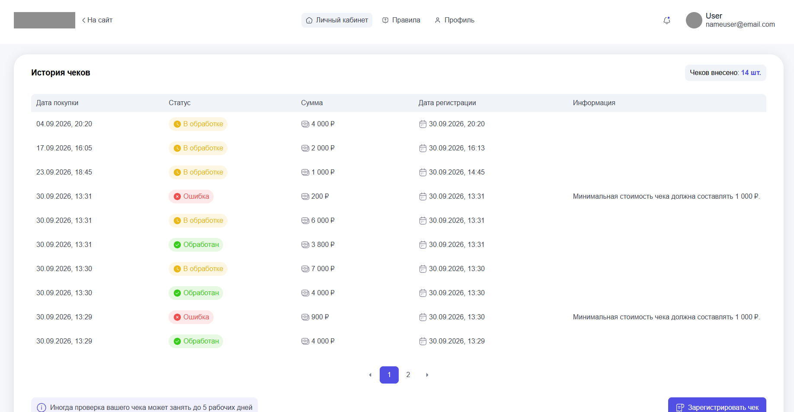

# Промо-акция «Чек на удачу» (Test Task)

MVP-приложение для регистрации и модерации чеков покупателей.

## Технологический стек
- **Backend:** Python 3.12, Django 5.1, Django REST Framework (DRF)
- **Database:** PostgreSQL 16
- **Frontend:** React 18, Vite
- **Infrastructure:** Docker, Docker Compose

## Скриншот личного кабинета


## Как запустить проект

1. Склонируйте репозиторий.
   ```bash
   git clone git@github.com:AncientSteal/Test-Check-on-luck.git
   ```
2. В корне проекта создайте файл `.env` (можно просто скопировать из примера):
   ```bash
   cp .env.example .env
   ```
3. Запустите Docker Desktop на своём устройстве, а затем сборку и старт контейнеров:
   ```bash
   docker compose up --build
   ```
4. После успешного запуска всех сервисов откройте в браузере: **`http://localhost:8000/`**

**Важно для Production:** Текущий `SECRET_KEY` в `.env.example` предназначен только для локального тестирования. При деплое на боевой сервер необходимо сгенерировать уникальный ключ (например, через `django.core.management.utils.get_random_secret_key()`).

## Тестовые доступы (Данные для проверки)
Для тестирования функционала после выполнения сборки и запуска контейнера автоматически будет создан аккаунт администратора, если таковой отсутсвовал:
- **Логин:** `admin`
- **Пароль:** `admin1234`

### Сценарий проверки:
1. Перейдите на `http://localhost:8000/`. Вас автоматически перенаправит на форму авторизации, если вы ещё не зарегистрировались.
2. Введите указанные выше доступы. Сервер авторизует вас и автоматически перенаправит на фронтенд-приложение Личного кабинета (`http://localhost:5173`).
3. Для проверки панели модератора перейдите в админку: `http://localhost:8000/admin/`.

## Решение спорных моментов (Архитектурная логика)
1. **Повторная отправка отклоненного чека:** Если модератор ошибочно отклонил чек, бизнес-логика предполагает ручное изменение статуса этого же чека в админке модератором, а не повторную регистрацию пользователем. В модели чека на уровне СУБД PostgreSQL реализован составной уникальный индекс через `UniqueConstraint(fields=['fn', 'fd', 'fp'])`. Это физически защищает базу данных от появления дубликатов чеков. На фронтенде при попытке отправить дубликат срабатывает `UniqueTogetherValidator` в DRF и выводит пользователю понятную ошибку в верх формы.

2. **Часовые пояса:** В настройках проекта включен режим `USE_TZ = True`. Даты начала и конца акции в `.env` обрабатываются относительно UTC. Время покупки чека при валидации на бэкенде принудительно переводится в (UTC) с помощью `zoneinfo`. Это защищает систему от махинаций со сменой часовых поясов на устройствах пользователей.

3. **Авторизация React и Django:** Поскольку в ТЗ было указано использовать стандартный `django.contrib.auth` и не верстать кастомные формы входа, был выбран классический и безопасный подход **Session-based Authentication**. Фронтенд на React общается с API через прокси в Vite и передает `X-CSRFToken` в заголовках `fetch`-запросов, считывая его из кук браузера, что защищает приложение от CSRF-атак.

## Статус выполнения (В рамках 5-часового лимита)

В соответствии с рекомендациями ТЗ, разработка была разделена на этапы с фиксацией времени:

1. **За первые 5 часов (Обязательный MVP) полностью реализовано:**
   - **Вся бизнес-логика и бэкенд-архитектура:** Инициализация Docker Compose, настройка PostgreSQL, проектирование модели чека с составным уникальным индексом, вся логика API (DRF) и сквозная валидация (проверка уникальности реквизитов и валидация периодов акции из `.env`).
   - **Интеграция и безопасность:** Настройка Session-based авторизации между фронтендом и бэкендом, обход CORS и внедрение защиты от CSRF-атак (`X-CSRFToken`).
   - **Интерфейс (React):** Полноценно оживлен весь ключевой функционал SPA — динамическое переключение экранов, отправка чеков через `fetch` с клиентской JS-валидацией, вывод списка чеков текущего пользователя в таблицу и пагинация по 10 элементов.

2. **Что было доработано за рамками 5 часов (Вне MVP):**
   - **Стилизация интерфейса:** Базовая верстка элементов была сделана в рамках основного времени, однако детальная стилизация по макету Figma, наведение красоты, проработка адаптивного CSS под мобильные экраны и работа с svg были завершены уже после основной сборки.
   - **Документация:** Написание подробного README-руководства.
   - **Дополнительные фичи** Описаны в разделе ниже.

### Поле автоматического заполнения формы из строки QR-кода
Часто при регистрации чеков в реальных промо-акциях камера смартфона в браузере не может сфокусироваться на QR-коде. Для решения этой проблемы в форму добавлен альтернативный инструмент — **поле быстрой вставки сырой строки QR-кода**.

- Пользователь вставляет системную строку чека (которую можно скопировать из приложения ФНС или банка), и форма заполняется автоматически.
- Вся логика парсинга полностью декомпозирована и вынесена из React-компонента в изолированную утилиту `utils/parseQrString.js`. Разбор параметров строки реализован через нативный браузерный класс `URLSearchParams`. Системный формат даты чека `YYYYMMDDTHHMMSS` автоматически переводится регулярным выражением в валидный для HTML5 формат `YYYY-MM-DDTHH:MM`.

   **Пример 1 (Валидный чек на 1850 руб):** 
  `t=20260930T145500&s=1850.20&fn=9999456789123456&i=7788&fp=33445566`

   **Пример 2 (Валидный чек на 3200 руб):** 
  `t=20261001T154500&s=3200.00&fn=1111222233334444&i=8899&fp=99887766`


## 🤖 Работа с ИИ (Использование нейросетей)

В процессе разработки ИИ использовался как виртуальный тимлид и напарник для ускорения рутинных операций и совместного проектирования архитектуры. 

- **Где ИИ помог сильнее всего:**
  ИИ отлично справился с генерацией начальной структуры (базовые `Dockerfile`, `docker-compose.yml`) и рутинного построения tamplate-шаблонов React-компонентов. Очень много времени удалось сэкономить при написании стилей и полей формы. Рефакторинг помог взглянуть на свой код со стороны, чтобы найти более чистые гибкие решения. Также нейросеть помогла быстро набросать регулярные выражения для разбора строки QR-кода в утилите `parseQrString.js`.

- **Что ИИ выдал неправильно и как это было замечено:**
  1. *Ошибка в регулярном выражении:* ИИ сгенерировал маску `/^\d+\$/` для валидации цифровых полей. Ошибка была замечена при тестировании формы, где валидация на клиенте считала цифры браком и требовала буквальный символ знака доллара на конце. Исправил выражение на `/^\d+$/`.
  2. *Несуществующий аргумент DRF:* В сериализаторе ИИ предложил несуществующий параметр `read_name='status_display'` внутри `CharField` (галлюцинация ИИ). Ошибка была обнаружена по логам контейнера бэкенда (`TypeError: got an unexpected keyword argument`). Аргумент был удален.
  3. *Нарушение чистоты кода в компоненте формы:* ИИ часто может в одном React компоненте смешать несколько разных логических структур. Как например парсинг строки qr-кода, правила валидации и рендер самой формы. Проблему удалось быстро решить путём распределения кусочков кода по модулям и папкам.

- **Какие места я бы переписал, будь больше времени:**
  1. *Покрытие тегами:* В компоненте `ReceiptsList.jsx` при переключении на мобильные карточки я бы добавил более гибкую семантическую верстку вместо жесткой привязки к `td` и псевдоэлементам, чтобы код был еще чище.
  2. *Тестирование кода:* Покрыл бы вынесенные в `utils/` чистые функции валидации и парсинга полноценными тестами на `Vitest`, как и планировалось изначально. Также занялся бы написанием тестов для сериализатора и вьюх на бэкенде.